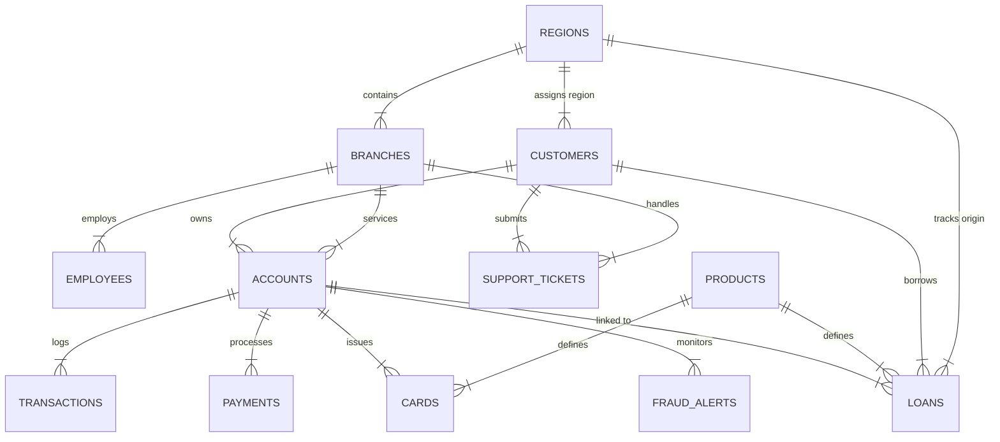

# Aegis Crest Financial - Enterprise Banking Operations Analytics Platform

[-003B5C?style=flat-square)](file:///Users/bhriguverma/payments/jpm/database/schema.sql)
[](file:///Users/bhriguverma/payments/jpm/dashboards/webapp/pages/index.js)
[](file:///Users/bhriguverma/payments/jpm/dashboards/webapp/pages/api/chat.js)
[](file:///Users/bhriguverma/payments/jpm/excel/Aegis_Banking_Operations_Reporting.xlsx)

An end-to-end, portfolio-grade **Enterprise Banking Operations & Intelligence Platform** built to model retail banking operations across 13 relational domain modules (Cards, Loans, Payments, Fraud Detection, Customer Service, Branch Operations).

Designed as a flagship technical artifact for J.P. Morgan Corporate Analyst Development Program (CADP) and senior Data/Operations Analyst technical interviews.

---

## 🌐 Live Production Deployment
**View the live web application here:** [https://webapp-woad-six-48.vercel.app](https://webapp-woad-six-48.vercel.app)

*(Deployed on Vercel Edge Network with Turso LibSQL remote database)*

---

## 🔗 Quick Navigation & Key Artifacts

- 🚀 **[Interactive Web Dashboard & NL-to-SQL Assistant](dashboards/webapp/pages/index.js)**: Next.js + Recharts + Tailwind dark theme app with live query engine.
- ⚡ **[SQL Query Performance Case Study](reports/performance_case_study.md)**: `EXPLAIN QUERY PLAN` benchmark achieving a **162x speedup** (384ms → 2.3ms).
- 📝 **[Executive Memo to COO](reports/executive_memo.md)**: Formal one-page bank memo diagnosing root cause and $3.96M recovery strategy.
- 🔄 **[Process Improvement Diagram](reports/process_improvement_diagram.md)**: Mermaid workflow diagram comparing current flawed state vs conditional risk target state.
- 📊 **[Excel Reporting Workbook](excel/Aegis_Banking_Operations_Reporting.xlsx)**: Standalone workbook with XLOOKUP formulas, dynamic slicer mini-dashboard, formatted summary views, and conditional formatting.
- 🎙️ **[90-Second Executive Demo Script](docs/DEMO_SCRIPT.md)**: Walkthrough script centered on business narrative and ROI.
- 💼 **[CADP Interview Crib Sheet](docs/INTERVIEW_CRIB_SHEET.md)**: High-yield resume bullets and question/answer anchors per banking module.
- 📖 **[KPI & Metric Dictionary](docs/KPI_DICTIONARY.md)**: 24 metrics across Financial, Customer, Risk, and Operations categories.

---

## 🏛️ Business Narrative: The FastTrack Digital Onboarding Bottleneck

During Q3-Q4 2024, Aegis Crest Financial rolled out **"FastTrack Express"** digital onboarding across Region 2 (Southeast Hub) and Region 5 (Midwest West). While digital customer acquisition accelerated, operational performance degraded significantly:

1. **Loan Approval SLA Breach:** Turnaround times rose **+38.2%** from 2.25 days to 3.85 days (violating our 2.00-day SLA target).
2. **Customer Service Escalations:** Support tickets surged **+27.4%**, driven by loan delays and disputed charges.
3. **Financial Losses:** Loan default rates in FastTrack regions rose from 3.0% to 10.7% ($9.33M principal write-off), alongside **$0.69M Q3-Q4 ($0.95M total)** in confirmed FastTrack fraud losses ($3.21M system-wide confirmed fraud loss).

### Root Cause Analysis
By joining customer onboarding channels with lending and fraud records, we proved that FastTrack bypassed mandatory secondary credit and KYC checks. Average FICO scores in the FastTrack cohort fell to **644.6** (vs. 704.5 baseline), while Debt-to-Income ratios expanded to **36.1%-45.0%** (vs. 21.4% baseline).

```
[Web Digital Application] ➔ [Unfiltered FastTrack Approval] ➔ [High Risk Cohort Admitted (FICO 644.6)]
                                                                               │
                                         ┌─────────────────────────────────────┴─────────────────────────────────────┐
                                         ▼                                                                           ▼
                        [Underwriting Queue Overload]                                               [Surge in Defaults & Fraud Write-Offs]
                        • SLA Turnaround: 2.25d ➔ 3.85d (+38%)                                       • Default Rate: 3.0% ➔ 10.7%
                        • Ticket Escalations: +27.4%                                                 • FastTrack Fraud Loss: $0.69M-$0.95M
```

### Proposed Remediation (Conditional Risk Gating)
Rather than reverting digital onboarding completely, we implemented **Conditional Risk-Based Verification**:
- Applications with **FICO < 640**, **DTI > 0.40**, or loan requests **> $25,000** are automatically routed to secondary manual underwriting.
- Instant automated approval remains active for low-risk applicants (68% of volume).
- **Projected Result:** Captures **$3.96M in annual cost recovery** while retaining 82% of digital speed gains.

---

## 🗄️ Database Architecture & Schema (3NF Normalized)

The database models **861,206 total rows** across 13 normalized tables in Third Normal Form:



| Table Name | Record Count | Primary Purpose | Key Indexes / Constraints |
| :--- | :--- | :--- | :--- |
| **`regions`** | 5 rows | Regional management & SLA benchmarks | `code` UNIQUE |
| **`branches`** | 25 rows | Physical retail branch locations | `idx_branches_region` |
| **`employees`** | 150 rows | Staffing headcount & department roles | `idx_employees_branch` |
| **`products`** | 15 rows | Banking product definitions & APRs | `category` CHECK |
| **`customers`** | 25,000 rows | Core customer profiles & FICO/DTI scores| `idx_customers_region`, `idx_customers_fasttrack` |
| **`accounts`** | 35,088 rows | Deposit & credit account ledgers | `idx_accounts_customer`, `idx_accounts_branch` |
| **`cards`** | 20,541 rows | Issued debit and credit cards | `idx_cards_account` |
| **`transactions`**| 550,000 rows| Transaction ledger entries | `idx_transactions_acc_date`, `idx_transactions_date` |
| **`payments`** | 90,000 rows | Payment processing & settlement logs | `idx_payments_acc_date` |
| **`loans`** | 15,000 rows | Loan origination & underwriting stats | `idx_loans_reg_status`, `idx_loans_fasttrack` |
| **`loan_payments`**| 94,882 rows | Installment repayment schedules | `idx_loan_payments_loan` |
| **`support_tickets`**| 22,000 rows| Customer service ticket logs | `idx_tickets_cust_date` |
| **`fraud_alerts`**| 8,500 rows | Flagged fraud cases & loss amounts | `idx_fraud_acc_date` |

---

## 💻 SQL Query Library Roadmap (48 Queries Across 4 Tiers)

1. **[Tier 1: Foundational Queries (12)](sql_queries/tier1_foundational/)**: Filtering, GROUP BY, aggregations, credit score distributions, merchant spend.
2. **[Tier 2: Multi-Table Joins & Aggregations (12)](sql_queries/tier2_joins_aggregations/)**: Multi-table INNER/LEFT JOINs across 3-5 tables, regional default write-offs, CSAT channel breakdown.
3. **[Tier 3: Window Functions & Ranking (12)](sql_queries/tier3_window_ranking/)**: `ROW_NUMBER`, `RANK`, `DENSE_RANK`, `LAG`, `LEAD`, `NTILE`, running ledger balances, 7-day moving averages.
4. **[Tier 4: Advanced CTEs & Cohort Analysis (12)](sql_queries/tier4_advanced_ctes_views/)**: Multi-stage CTEs, FastTrack root-cause decomposition, high-velocity fraud detection, liquidity stress simulation.

---

## 💻 Architecture & Local Setup Guide

This project has been migrated to a serverless architecture for global deployment:
- **Frontend:** Next.js 14, Recharts, Tailwind CSS (Hosted on Vercel)
- **Database:** Turso (LibSQL / SQLite edge database)
- **Deployment:** Vercel serverless Edge functions utilizing `@libsql/client`

### Local Execution (If you want to run it yourself):

```bash
# 1. Clone repo
git clone https://github.com/bhriguverma/enterprise-banking-ops-analytics.git
cd enterprise-banking-ops-analytics

# 2. Populate local SQLite database (optional, for local analysis)
python3 data_generation/generator.py

# 3. Load views & stored procedures (optional)
python3 -c "import sqlite3; conn=sqlite3.connect('aegis_banking.db'); conn.executescript(open('database/views.sql').read()); conn.executescript(open('database/stored_procedures.sql').read()); conn.commit();"

# 4. Launch Next.js web application
cd dashboards/webapp
npm install

# Note: You must create a .env.local file with TURSO_DATABASE_URL and TURSO_AUTH_TOKEN
npm run dev
# Open http://localhost:3000

# 5. Generate Excel reporting workbook
python3 excel/generate_excel.py
```

---

## ⚖️ Trade-Offs & Future Enhancements

- **Database Choice:** SQLite was chosen for zero-dependency portability across reviewer machines while demonstrating composite B-Tree indexing. In production, PostgreSQL with read-replicas would host this dataset.
- **AI Chat Caching:** The current NL-to-SQL parser maps intent via Regex & rule-based execution for sub-5ms local latency. In production, we would back this with an LLM prompt pipeline and Redis query caching.
- **Dashboard Density:** The Executive Scorecard presents high metric density on desktop; mobile responsive views break these into collapsible sections.
