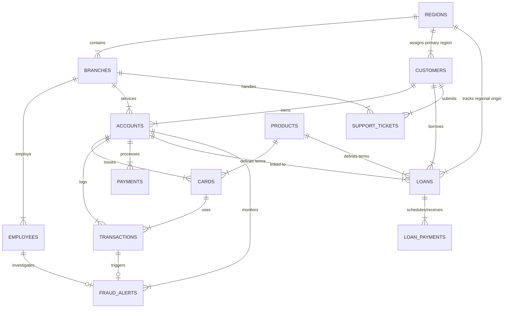

# Aegis Crest Financial - Database ER Diagram & Architecture

## Overview
The Aegis Crest Financial operational database is a **Third Normal Form (3NF)** relational database designed to track consumer banking operations across retail branches, accounts, digital onboarding, loans, card transactions, customer service, and fraud detection.

## Entity Details

| Table | Entity Category | Primary Key | Foreign Keys | Key Indexes |
| :--- | :--- | :--- | :--- | :--- |
| **`regions`** | Dimension | `region_id` | - | `code` |
| **`branches`** | Dimension | `branch_id` | `region_id` | `idx_branches_region` |
| **`employees`** | Dimension | `employee_id` | `branch_id` | `idx_employees_branch` |
| **`products`** | Dimension | `product_id` | - | `category` |
| **`customers`** | Core Fact/Dim | `customer_id` | `region_id` | `idx_customers_region`, `idx_customers_fasttrack` |
| **`accounts`** | Core Fact | `account_id` | `customer_id`, `branch_id` | `idx_accounts_customer`, `idx_accounts_branch` |
| **`cards`** | Operational Fact | `card_id` | `account_id`, `product_id` | `idx_cards_account` |
| **`transactions`** | High-Volume Fact | `transaction_id` | `account_id`, `card_id` | `idx_transactions_acc_date`, `idx_transactions_date` |
| **`payments`** | Operational Fact | `payment_id` | `account_id` | `idx_payments_acc_date` |
| **`loans`** | Financial Fact | `loan_id` | `customer_id`, `account_id`, `product_id`, `region_id` | `idx_loans_reg_status`, `idx_loans_fasttrack` |
| **`loan_payments`** | Financial Fact | `loan_payment_id` | `loan_id` | `idx_loan_payments_loan` |
| **`support_tickets`**| Ops & Service Fact| `ticket_id` | `customer_id`, `account_id`, `branch_id` | `idx_tickets_cust_date` |
| **`fraud_alerts`** | Risk & Security Fact | `alert_id` | `account_id`, `transaction_id`, `investigated_by_emp_id` | `idx_fraud_acc_date` |

## Key Architectural Decisions

1. **Explicit Foreign Key Cascades & Constraints:**
   - Deleting an account cascades to cards, transactions, payments, and fraud alerts to preserve operational context.
   - Deleting a region or branch is RESTRICTED if active customers, accounts, or employees exist.

2. **Performance Composite Indexing:**
   - High-throughput operational lookup queries (`(account_id, transaction_date)` and `(customer_id, ticket_date)`) are indexed to eliminate full table scans during aggregations.

3. **Injected Business Case Tracking Columns:**
   - `customers.is_digital_fasttrack` & `customers.onboarding_channel`
   - `loans.approval_turnaround_days` & `loans.is_fasttrack_approval`
   - `support_tickets.category` & `support_tickets.escalation_flag`
   - `fraud_alerts.fraud_type` & `fraud_alerts.loss_amount`
