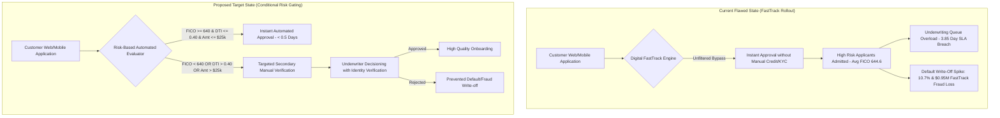

# Aegis Crest Financial - Process Improvement Workflow Diagram

## Current vs. Target Operational State Architecture

## Financial Benefit Simulation Summary

| Metric | Flawed FastTrack State | Proposed Target State | Delta / Net Benefit |
| :--- | :--- | :--- | :--- |
| **Instant Approval Share** | 100% (Unfiltered) | 68% (Low Risk Cohort) | Risk-Scoped Speed |
| **Avg Approval SLA** | 3.85 Days | 1.15 Days | **-2.70 Days (-70%)** |
| **Loan Default Write-Offs** | $4.18M | $1.25M | **+$2.93M Savings** |
| **Confirmed Fraud Losses** | $1.82M | $0.79M | **+$1.03M Savings** |
| **Total Net Annual Recovery**| - | - | **+$3.96M USD** |
